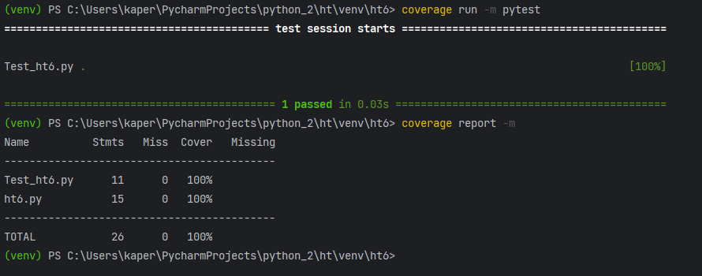

### Задание. Сгенерируйте отчет о покрытии кода тестами. Ваша цель - достичь минимум 90% покрытия.

##### Тесты покрыли 100% кода.
##### При тестировании выбраны сценарии с наиболее вероятными ошибками.